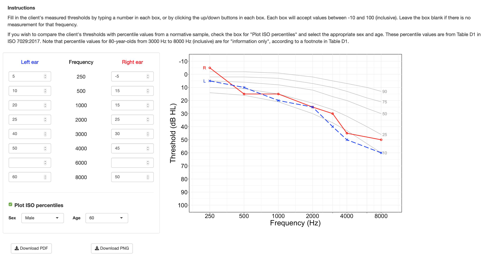

#### About this project ####
 
When a client has their hearing thresholds measured in a clinic, the results are plotted on a graph with sound frequency on the x-axis and dB (the lowest sound level they can hear) on the y-axis. Usually there is no additional information on the graph about how well the client can hear relative to other people, to put their hearing situation in better context.
 
This app allows the user to plot a client's hearing test results (audiogram) and to display percentile data from an otologically normal age- and sex-matched group for comparison.
 
#### Running the app online ####
 
The app runs online at this link:
[https://huiwen-goy.shinyapps.io/shiny_audiogram/](https://huiwen-goy.shinyapps.io/shiny_audiogram/)
 
#### Running the app offline (on a local computer) ####
 
The code used to create the app is located in the app.R file, and the percentile data are located in the csv file.  
 
* Install R and R Studio. 
* Install R packages 'shiny' and 'ggplot2'.
* Save the csv file in the same directory as the app.R file.
* In R Studio, open the app.R file. Click the "Run" button, or use the runApp() function.
