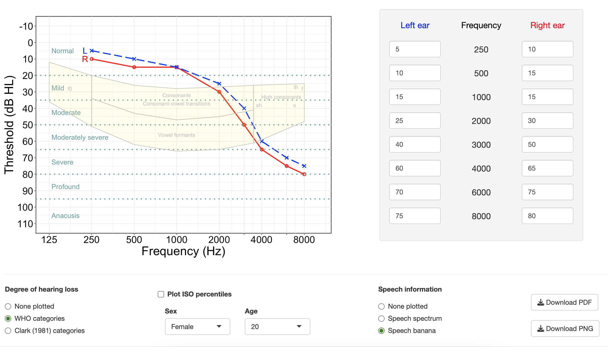

## Putting hearing test results in context ##

#### About this project ####
 
When a client has their hearing thresholds measured in a clinic, the results are plotted on a graph with sound frequency on the x-axis and the lowest sound level they can hear (thresholds) on the y-axis. Clients don't always know what to make of these results, and a frequent question is "What percentage hearing loss do I have?"  
 
It's not really meaningful to try to collapse an audiogram into a single percentage value (see section "Audiogram" on [this page](https://medicine.uiowa.edu/iowaprotocols/how-read-audiogram) for more information). A more useful approach for helping a client understand what their hearing test results mean would be to overlay elements on top of their audiogram that put the person's hearing thresholds in context, e.g., how do they compare with other people of similar age? What kind of speech information falls within their audible range? Is their hearing loss considered mild, moderate, or severe by health organizations?  
 
#### Running the R Shiny app online ####
 
[https://huiwen-goy.shinyapps.io/shiny_audiogram/](https://huiwen-goy.shinyapps.io/shiny_audiogram_v2/)  

The app runs in a browser window, and doesn't store information after a user exits the session. The "Download PDF" and "Download PNG" buttons can be used to capture a screenshot of the plot before closing the browser window.  
 
#### Running the R Shiny app offline ####
 
* Install R and R Studio. 
* Install R packages 'shiny' and 'ggplot2'.
* Save the three csv files in the same directory as the app.R file.
* In R Studio, change the working directory to the folder containing those files. Open the app.R file in R Studio. Click the "Run" button, or use the runApp() function.  

#### A basic guide to making an R Shiny app ####

This [guide]() describes the basic components of an R Shiny script, and contains an example of a simple R Shiny app that re-plots a display depending on how the inputs change and which additional display elements are selected.  

